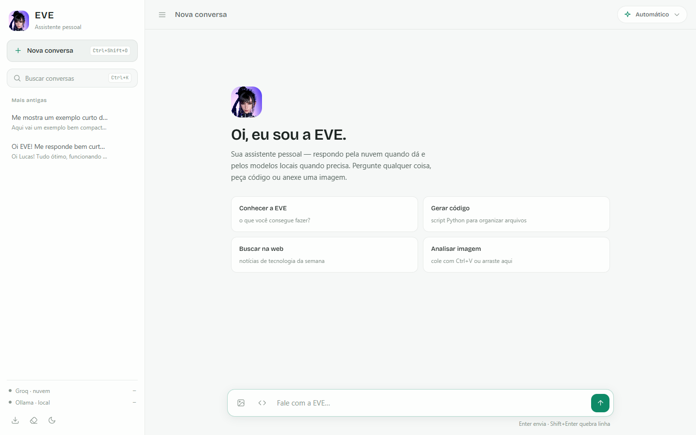

# EVE - Assistente Virtual Inteligente

> **Status: projeto pessoal, em uso do autor.** Não é produto lançado nem
> serviço hospedado — roda localmente, com suas próprias chaves.

Assistente de IA pessoal com personalidade (inspirada na EVE de Stellar Blade),
que roda com modelos locais (Ollama) e nuvem (Groq), com interface web moderna,
GUI desktop, CLI e bot de Discord com voz.


_Interface web (HTML/CSS/JS puro, sem CDN — funciona offline). O rodapé da barra
lateral mostra o estado ao vivo das duas engines: Groq (nuvem) e Ollama (local)._

## Estrutura

```
core/       Motor principal (Brain V2, router, contexto, personalidade)
engines/    Engines de modelo (Groq API, Ollama)
memory/     Memória em camadas (short/long-term, preferências, cache)
skills/     Skills (calculadora, análise de logs, arquivos etc.)
voice/      TTS (Edge) e STT (Whisper) para o Discord
web/        Interface web (HTML/CSS/JS puro, sem CDN — funciona offline)
data/       Dados de runtime (memória, chats, flags) — fora do git
docs/       Documentação e guias de instalação
scripts/    Scripts utilitários (atalhos, instalação)
tests/      Testes unitários e scripts de teste manuais
```

## Como rodar

1. **Dependências**

   ```
   pip install -r requirements.txt
   ```

   Para o bot Discord com voz: `pip install -r requirements_voice_recv.txt`
   (e FFmpeg instalado no sistema).

2. **Configuração** — copie `.env.example` para `.env` e preencha:

   ```
   GROQ_API_KEY=...        # https://console.groq.com/keys
   DISCORD_BOT_TOKEN=...   # só para o bot Discord
   ```

3. **Ollama** (modelos locais) — instale em https://ollama.com e baixe:

   ```
   ollama pull qwen3.5:9b          # chat geral (multimodal + thinking, 6.6GB)
   ollama pull qwen3.5:4b          # chat rápido (3.4GB)
   ollama pull qwen3-vl:8b         # visão/imagens (6.1GB)
   ollama pull ornith:9b           # código agêntico, jul/2026 (5.6GB)
   ollama pull qwen2.5-coder:7b    # código (fallback estável, 4.7GB)
   ollama pull deepseek-r1:8b      # raciocínio (5.2GB)
   ```

   Todos rodam bem numa GPU de 8GB (RTX 4060 e similares). Opcional:

   ```
   ollama pull granite4.1:8b       # RAG/tools/JSON estruturado (IBM, 5.3GB)
   ollama pull qwen3-vl:4b         # visão leve (3.3GB)
   ```

4. **Interfaces**

   | Interface       | Comando                      |
   |-----------------|------------------------------|
   | **Web** (nova)  | `python eve_web.py` → http://127.0.0.1:8765 |
   | GUI desktop     | `python eve_gui.py`          |
   | Terminal        | `python main.py`             |
   | Discord         | `python eve_discord_bot.py`  |

   **Executável (sem terminal):** `dist/EVE/EVE.exe` — abre o navegador
   sozinho ao iniciar (atalho "EVE" na área de trabalho). Os dados ficam
   em `dist/EVE/data/` e o `.env` mora ao lado do exe. Para recompilar:

   ```
   pip install pyinstaller
   pyinstaller --noconfirm --onedir --name EVE --icon eve_icon.ico ^
     --add-data "web;web" --add-data "core/personality.txt;core" ^
     --add-data "assets;assets" --add-data "eve_icon.ico;." ^
     --add-data "eve_avatar.png;." --collect-all spellchecker eve_web.py
   copy .env dist\EVE\.env
   ```

## Interface web

A interface recomendada. Roda 100% local (servidor FastAPI + página estática,
sem nenhum CDN — fontes premium servidas de `web/fonts/`):

- **Streaming de tokens** em tempo real (nuvem e local)
- **Parar geração** no meio (botão ou Esc) e **regenerar resposta**
- **Seletor de modelo** por conversa: automático, Groq específico ou
  qualquer modelo Ollama instalado
- **Busca em conversas** (título e conteúdo), **renomear** e agrupamento
  por data (Hoje / Ontem / Últimos 7 dias)
- **Tema escuro e claro** (persistido), atalhos: Ctrl+K busca,
  Ctrl+Shift+O nova conversa, Esc interrompe
- **Markdown + realce de sintaxe** com copiar código e copiar mensagem
- **Anexos de imagem** (botão, colar com Ctrl+V ou arrastar) → modelo de visão
- **Modo código** (`</>`): força o modelo forte de código na nuvem
- **Conversas persistentes**, rascunho salvo, scroll inteligente durante
  o streaming, status ao vivo das engines
- Indicadores por resposta: nuvem/local, busca web, tempo, interrompida
- Exportar conversa em Markdown, limpar memória, responsivo (funciona no
  celular da mesma rede com `EVE_WEB_HOST=0.0.0.0`)

## Modelos

| Papel               | Local (Ollama)      | Nuvem (Groq)           |
|---------------------|---------------------|------------------------|
| Chat geral          | `qwen3.5:9b`        | `openai/gpt-oss-20b`   |
| Código              | `ornith:9b` (fallback `qwen2.5-coder:7b`) | `openai/gpt-oss-120b` (padrão) |
| Visão (imagens)     | `qwen3-vl:8b`       | `qwen/qwen3.6-27b` (preview) |
| Raciocínio          | `deepseek-r1:8b`    | `openai/gpt-oss-120b`  |

> ⚠️ Removidos do registro em jul/2026 por deprecação na Groq:
> `qwen/qwen3-32b` (desligamento 17/07/2026) e `llama-3.3-70b-versatile`
> (16/08/2026) — o substituto oficial de ambos é `openai/gpt-oss-120b`.
> Troque via env `EVE_GROQ_MODEL` se quiser outro.

Overrides por variável de ambiente (opcional): `EVE_GROQ_MODEL`,
`EVE_CHAT_MODEL`, `EVE_CODE_MODEL`, `EVE_REASON_MODEL`, `EVE_VISION_MODEL`.

## Recursos

- **Híbrido nuvem/local**: chat tenta o Groq (rápido) e cai para o Ollama
  local automaticamente se a nuvem falhar. Código sempre via Groq.
- **Streaming**: no terminal, na GUI e na web, respostas aparecem
  progressivamente enquanto são geradas — inclusive as da nuvem (SSE).
- **Busca web**: Wikipedia → DuckDuckGo → Google → SearXNG, com regras
  anti-alucinação no prompt.
- **Memória em camadas**: curto/longo prazo, preferências e resumo de sessão.
- **Comandos do Discord**: `!eve`, `!falar`, `!join`, `!leave`, `!listen`,
  `!memoria` (ver/limpar memória), `!status` (saúde dos sistemas).
- **Feature flags** em `data/eve_features.json` — o servidor web cria o
  arquivo com os recursos modernos ligados (Brain V2, memória em camadas,
  skills) na primeira execução; configuração existente é respeitada.

## Testes

```
python -m unittest discover -s tests -p "test_unit*.py" -v
python -m unittest tests.test_unit_fixes tests.test_new_features -v
```

## Segurança

- Chaves e tokens moram **apenas** no `.env` (ignorado pelo git).
- Dados pessoais (memória, chats, uploads) ficam em `data/` (ignorado pelo git).
- O servidor web escuta somente em `127.0.0.1` por padrão.
